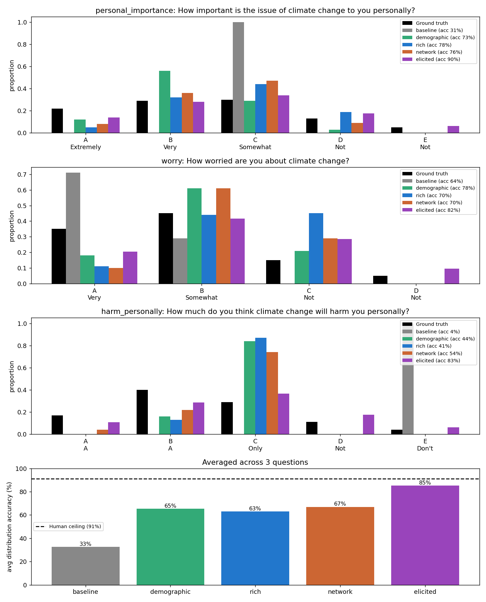

# LLM personas vs real UK opinion

An independent study of whether populations of LLM "personas" reproduce the
real *distribution* of opinions a human group holds, measured against published
nationally-representative UK surveys. Five persona methods, two Claude models,
distribution-fidelity metrics, and purpose-built diagnostics that catch a model
being right for the wrong reasons.

## The question

A synthetic population is only useful (for market research, policy, or product)
if its aggregate opinion *distribution* matches the real one, not just if each
persona sounds plausible. So I make it measurable: build personas, ask them
real single-select survey questions, and score the distance between their answer
distribution and the published human result. The goal is not one clever method
but a fair comparison, and diagnostics that tell genuine fidelity apart from a
lucky-looking number.

## What I built

A small, reproducible harness ([`personas_sim/`](personas_sim)) that runs five
persona methods against the same ground truth: **baseline** (no persona),
**demographic** (sampled to the survey's own weighted demographics),
**rich** (fuller first-person prompt), **network** (a toy multi-agent
discussion before answering), and **elicited** (each persona reports a
probability distribution, which are averaged). Each runs on two models
(`claude-haiku-4-5`, `claude-sonnet-4-6`). Fidelity is **distribution accuracy
= 1 − TVD** plus **Jensen-Shannon divergence**. Three diagnostics do the
heavy lifting: a **peak / mode-collapse** check, a **causal sub-group gradient**
(does a known real-world difference actually appear, with a matched control),
and a **persona-dispersion / recital-detection** check (is the model simulating
distinct people or reciting a memorised aggregate?). The same harness is then
pointed at a second topic (AI attitudes) to test generality.

## Results



100 personas, 3 Yale climate questions, two models. Distribution accuracy
(`1 − TVD`, %); the human-replication ceiling is about 91% (people change their
own survey answer ~19% of the time on re-asking, Park et al. 2024).

| method | Haiku avg | Sonnet avg | read |
|--------|:---:|:---:|---|
| baseline | 40.0 | 32.7 | no-persona model collapses to one option |
| demographic | 63.3 | 65.3 | the synthetic-persona plateau (~60-67%, matching prior prompt-based work) |
| rich | 54.7 | 63.0 | more backstory hurts on Haiku, helps on Sonnet |
| network | 45.7 | 67.0 | flips from worst to best across models |
| elicited | 93.8 | 85.2 | highest, but see "where it broke" |

**The headline finding (and the most distinctive part of the project): adding
one sentence of the right psychographic axis breaks the plateau, and a causal
control proves it is real.** On Sonnet, climate Q1, the `demographic` persona
sits at 72.5% (mode-collapsed onto "Very important"). Adding a single
political-identity sentence lifts it to **91.5%**, near the ceiling. Crucially,
this is not just a better number: the paired **concern gradient**
(climate-progressive voters minus climate-skeptic voters) is positive only when
the axis is in the prompt, and flat for the matched demographic control, so the
lift is genuinely caused by the axis, not leaking from correlated demographics.

| method (Sonnet, climate Q1) | accuracy | gradient in-prompt | gradient (demographic control) |
|---|:---:|:---:|:---:|
| demographic | 72.5% | n/a | n/a |
| **political** | **91.5%** | **+1.77** | +0.08 |
| values | 78.5% | +1.65 | -0.09 |
| openness | 77.5% | +1.30 | -0.08 |
| composite (all three) | 80.5% | see below | |

**Where it broke (equally important):**

- **Standard personas mode-collapse.** Demographic/rich/network pile onto the
  central answer (peaks 76-92% vs a true 30-45%). The peak diagnostic makes
  this visible at a glance.
- **A high score can be fake.** `elicited` beats the 91% human ceiling on Haiku
  (93.8%), which is a red flag, not a win. Its persona-dispersion is low (0.18)
  and its sub-group gradient is flat, so the model is **reciting a memorised
  population prior, not simulating distinct people**. On Sonnet it drops below
  the ceiling (85.2%) with higher dispersion (0.21) and a real gradient
  (+0.26): more genuine simulation, lower number. The recital-detection
  diagnostic is what separates the two.
- **Stacking axes does not compound.** A `composite` persona with all three
  axes (80.5%) lands *below* the best single axis (political, 91.5%); the
  weaker signals dilute the strong one, and the weakest axis's gradient
  collapses under competition. More conditioning is not better.

**Generality (AI attitudes): the dominant axis is topic-dependent.** Running
the same axes on a different topic (will LLMs be beneficial?, Ada Lovelace /
Alan Turing 2025) shows the winning axis *changes by question*:

| axis (in-prompt gradient) | climate | AI |
|------|:---:|:---:|
| political | +1.77 (dominant) | -0.16 (null) |
| openness | +1.25 (weakest) | +1.40 (dominant) |
| values | +1.73 | -1.42 (sign-flips) |

Political identity, the climate champion, carries no AI signal; Openness, the
weakest climate axis, dominates AI (openness to new technology); values flips
sign. The lesson: there is no single "best persona axis", only the right axis
for the question, and the gradient diagnostic is how you find it.

Per-run numbers are written to `results*.json`; deeper provenance and the
literature behind each choice are in [SOURCES.md](SOURCES.md).

> Caveat: N=100, single run per cell (about 3 points of LLM sampling noise), no
> bootstrap confidence intervals yet. Differences within a few points should be
> read as suggestive, not settled. See Limitations.

## How it works (methodology)

- **Ground truth.** Climate questions come from the Yale Program on Climate
  Change Communication, *Climate Change in the British Mind 2024* (10,660 UK
  respondents, 16+). The AI question comes from the Ada Lovelace / Alan Turing
  *How do people feel about AI?* survey (2025, n=3,513). Real published
  distributions, so the target cannot be moved after the fact.
- **Persona sampling.** Personas are drawn from the climate survey's *own
  weighted sample composition* (generation, sex, region, education, income), so
  the synthetic population matches the real frame by construction rather than by
  stitching in separate census tables. A psychographic axis is added as exactly
  one extra sentence, which keeps it a clean controlled comparison.
- **Why TVD and JSD.** Total Variation Distance is the intuitive distance
  between two distributions (the share of probability mass you would have to
  move to match), and `1 − TVD` reads naturally as an accuracy percentage. JSD
  is reported alongside as a symmetric, bounded second opinion. Both score the
  whole distribution, which is the quantity that actually matters here, not
  top-line agreement.
- **Diagnostics (the distinctive part).** Accuracy alone can be a coincidence,
  so every headline number is cross-checked: the **peak** check flags mode
  collapse; the **causal gradient** check asks whether a known real-world
  sub-group difference appears in the personas, with a matched demographic
  control (flat control + positive in-prompt gradient = the conditioning is
  doing real work); the **persona-dispersion** check asks whether the personas
  actually differ from each other or the model is reciting one aggregate.

## Reproducibility

```bash
# 1. Environment (Python 3.11)
conda create -n llm-persona python=3.11 -y && conda activate llm-persona
pip install -r requirements.txt

# 2. Offline smoke test: a mock model, no API key, no spend
USE_MOCK=1 python -m personas_sim.run

# 3. Real run (needs an Anthropic API key)
export ANTHROPIC_API_KEY=sk-ant-...
USE_MOCK=0 python -m personas_sim.run

# Optional: the psychographic axes on their own (cheap), or on the AI question
USE_MOCK=0 N=100 EXT_ONLY=1 python -m personas_sim.run
USE_MOCK=0 N=100 EXT_ONLY=1 EXT_QUESTION=ai_llm_benefit python -m personas_sim.run
```

The **mock model** is the default (`USE_MOCK=1`): it returns fake but
structured answers so the entire pipeline, metrics, and diagnostics run end to
end with no API key and no cost. Real-model runs set `MODEL=claude-sonnet-4-6`
or `claude-haiku-4-5`. Outputs: a per-question and per-topic table to stdout,
plus `results.json` and `comparison.png`. Tests: `python tests/test_evaluate.py`.

Or with Docker (runs the mock model, so no API key is needed):

```bash
docker build -t llm-persona .
docker run --rm llm-persona
```

## Limitations and next steps

- **No confidence intervals.** Single run per cell; a bootstrap CI over
  resampled personas would tell which method gaps are real. Highest-priority
  next step.
- **Approximate inputs.** The psychographic-axis marginals (political affiliation,
  Big Five openness, Schwartz values) are reasonable but approximate modelling
  inputs, not exact population statistics; the rigour is in the *direction* of
  the validated gradient, not the marginal.
- **Single item per topic for the generality test;** the AI ground truth is a
  third source with a slightly different (18+) frame.
- **Prompt-only.** Every method here conditions through the prompt. The
  literature suggests the larger lever is fine-tuning on scaled survey data
  (Suh et al. 2025), which is the natural direction beyond this study.
- **Further axes.** Media diet, religiosity, and concrete behavioural anchors
  are obvious additions, each testable with its own paired gradient.

## Repo map

```
personas_sim/
  config.py        questions, ground truths, demographic + psychographic marginals
  llm.py           the only model-facing code; mock fallback lives here
  personas.py      builds personas for each method
  evaluate.py      distribution accuracy (1 - TVD), JSD, peak, entropy
  consistency.py   within-persona stability across question rephrasings
  diagnostics.py   age / axis gradients (causal check) and persona-dispersion (recital check)
  run.py           runs everything, prints tables, writes results + plot
tests/             offline unit tests for the metrics and diagnostics
SOURCES.md         data provenance and the literature behind each design choice
```

## License

MIT, see [LICENSE](LICENSE).
